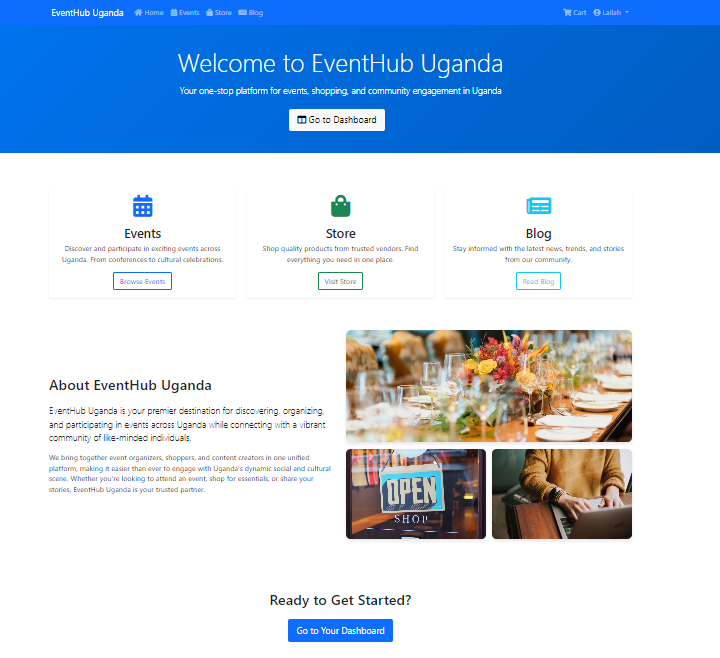

# Event Hub Uganda

Mbarara University of Science and Technology  
Faculty of Computing and Informatics  
Bachelor of Science in Computer Science
**Name:** Kobugabe Lailah  
**Registration Number:** 2023/BCS/002  
**Student Number:** 2300604329  
**Course Name:** Web Application Development  
**Course Code:** CSC2207  
**Date:** Monday,19th May, 2025

## Table of Contents

- [Project Overview](#project-overview)
- [Features Implemented](#features-implemented)
- [Screenshots and Page Explanations](#screenshots-and-page-explanations)
- [Django Concepts Demonstrated](#django-concepts-demonstrated)
- [Requirements](#requirements)
- [How to Run the Project](#how-to-run-the-project)
- [Example Files and Structure](#example-files-and-structure)
- [How to Contribute](#how-to-contribute)
- [Acknowledgements](#acknowledgements)

---

## Project Overview

Event Hub Uganda is a robust Django web application designed for event management, blogging, and e-commerce, with full user authentication and administration features. The project was initialized by cloning [stefanbschneider/django-hello-world](https://github.com/stefanbschneider/django-hello-world.git) and then expanded to include multiple apps, advanced data models, user registration, custom admin interfaces, and a modern, responsive user interface.

**Key Capabilities:**

- User registration, login, and profile management.
- Creation, viewing, and management of events.
- Event registration for users.
- Product browsing and purchasing via an online store.
- Blog posting, viewing and commenting.
- Secure, validated, and user-friendly experience with custom error handling and feedback.
- User access to a personalised dashboard with various features like managing events,
  managing blogs, and shopping all in one place.

---

## Features Implemented

### 1. Multiple Django Apps

- **Modular Architecture:** The project is divided into several Django apps (`blog`, `events`, `store`, `users`, and optionally `contact`), each responsible for a specific domain. This modularity makes the codebase easier to maintain and extend.
- **User Experience:** Users can seamlessly navigate between events, blogs, and the store, with each app providing a focused set of features.

### 2. Rich Data Models with Relationships

- **Real-World Modeling:** Each app defines at least two models, with relationships such as `ForeignKey` and `ManyToManyField` to represent real-world connections (e.g., users registering for events, products belonging to categories).
- **Benefits:** This structure allows for complex queries, data aggregation, and meaningful user interactions (e.g., viewing all events a user is registered for, or all comments on a blog post).
- **Implementation:**
  - `blog/models.py`: `Category`, `Post`, `Comment`
  - `events/models.py`: `EventCategory`, `Event`, `Registration`
  - `store/models.py`: `ProductCategory`, `Product`, `Order`, `OrderItem`

### 3. Custom Model Admin Classes

- **Enhanced Admin Experience:** Each app has an `admin.py` file with custom admin classes, providing features like list displays, filters, search, and inline editing for related models.
- **Benefits:** Administrators can efficiently manage content, users, and transactions from a single interface.
- **Implementation Example:**
  - `blog/admin.py` customizes the admin for `Post`, `Category`, and `Comment` models.

### 4. User Registration and Authentication

- **Secure Access:** Users can register, log in, log out, and manage their profiles securely.
- **Custom Forms:** The registration form (`CustomSignupForm` in `users/forms.py`) collects additional information (first name, last name, email) and provides validation.
- **Profile Management:** Users can update their profile and view a personalized dashboard.
- **Benefits:** Ensures only authorized users can access certain features, and provides a personalized experience.

### 5. Forms for Creating and Updating Models

- **User-Friendly Data Entry:** All create/update operations use Django forms, ensuring data is validated and user input is handled gracefully.
- **Custom and Model Forms:** Both `ModelForm` and custom forms are used for different scenarios (e.g., event creation, product addition, blog post submission, user registration).
- **Benefits:** Reduces errors, improves user experience, and enforces data integrity.

### 6. Custom Templating and Styling

- **Consistent Look and Feel:** Templates are organized by app and use a shared `base.html` for layout consistency.
- **Responsive Design:** Custom CSS (`static/css/style.css`, `static/css/dashboard.css`) and Bootstrap ensure the site looks good on all devices.
- **Benefits:** Users enjoy a visually appealing and intuitive interface.

### 7. Data Validation and Error Handling

- **Robust Validation:** Both models and forms include validation logic (e.g., unique slugs, required fields, min/max values).
- **User Feedback:** Custom error messages and feedback are provided for invalid input.
- **Custom Error Pages:** 404 and 500 error pages improve the user experience in case of issues.
- **Benefits:** Ensures data integrity and helps users correct mistakes easily.

### 8. Documentation

- **README.md:** This file explains the project structure, features, and setup instructions.
- **Code Comments:** The codebase is well-commented for clarity and maintainability.
- **Benefits:** Makes it easy for new developers or reviewers to understand and contribute to the project.

---

## Screenshots and Page Explanations

### 1. Home Page

**a) Home Page (Logged-in User)**



> **Explanation:**  
> This version of the home page is shown to users who are logged in. It features a personalized navigation bar, a prominent "Go to Dashboard" button, and access to all main features. The user can quickly access their dashboard, events, store, and blog, and is greeted with a welcome message.

**b) Home Page (Guest)**


> **Explanation:**  
> This version of the home page is shown to users who are not logged in. It features options to log in or create an account, and highlights the main features of the platform. The call-to-action encourages new users to sign up and existing users to log in to access personalized features.

---

### 2. Events Page


> **Explanation:**  
> This page displays a categorized list of events, with options to register for events, view event details, and filter by event type (e.g., Educational, Entertainment, Technology). Users can also create new events or view their own registrations from this page.

---

### 3. Registration Page


> **Explanation:**  
> The registration page allows new users to sign up by providing a username, email, and password. It includes form validation and a summary of account benefits, such as the ability to create blog posts, comment, register for events, and track orders.

---

### 4. Login Page


> **Explanation:**  
> This page enables existing users to log in securely. It features a welcome message, password reset option, and a clean, user-friendly interface.

---

### 5. Dashboard Page


> **Explanation:**  
> The personalized dashboard provides logged-in users with an overview of their activity, including their blog posts, comments, event participation, and quick actions to create new content or manage their profile.

---

### 6. Blog Page


> **Explanation:**  
> The blog page lists all blog posts with categories and options to read more or create new posts. Each post preview includes the title, author, date, and a snippet of the content.

---

### 7. Store Page


> **Explanation:**  
> The store page displays all available products, organized by category. Users can view product details, add items to their cart, and see stock availability and prices.

---

## Django Concepts Demonstrated

### 1. Setting up a Django Project

The project was initialized by cloning a basic Django repository and expanded to support multiple apps, static/media files, and custom settings.  
**Example:**

- `django_hello_world/settings.py` lists all installed apps and configures static/media directories.

### 2. Creating Django Models, Views, Templates

Each app defines its own models, views, and templates.

- **Models:**
  - `Post` in `blog/models.py`, `Event` in `events/models.py`, `Product` in `store/models.py`.
- **Views:**
  - `user_dashboard` in `users/views.py`, `event_list` in `events/views.py`.
- **Templates:**
  - `home.html`, `blog/post_detail.html`, `events/event_list.html`.

### 3. Working with Django Forms

Both `ModelForm` and custom forms are used for data entry and updates.
**Example:**

- `CustomSignupForm` in `users/forms.py` for user registration.

### 4. Working with Django's Admin Site

The admin interface is customized for each model, with list displays, filters, search fields, and inline editing for related objects.
**Example:**

- `PostAdmin` in `blog/admin.py`, `EventAdmin` in `events/admin.py`.

### 5. Using Django ORM and Queries

The project uses Django's ORM for all database operations, including complex queries, filtering, and aggregation.
**Example:**

- `Post.objects.filter(author=request.user)` in `users/views.py`.
- `Event.objects.filter(status='published')` in `events/views.py`.

### 6. Adding User Registration and Authentication

Users can register, log in, log out, and manage their profiles. Authentication is enforced for sensitive operations, and user sessions are managed securely.
**Example:**

- `signup` and `profile` views in `users/views.py`.

### 7. Database Design and Migrations

Models are designed with appropriate fields and relationships. Migrations are used to create and update the database schema as the project evolves.
**Example:**

- `python manage.py makemigrations` and `python manage.py migrate` commands.

### 8. Templating and Template Inheritance

The application uses a base template with `` tags, extended by all other templates for consistency and maintainability.
**Example:**

- `` in `blog/post_detail.html`.

### 9. Styling Templates with CSS

Custom CSS and Bootstrap are used to style the application, ensuring a modern and responsive design.
**Example:**

- `static/css/style.css` and `static/css/dashboard.css`.

### 10. Deploying a Django App

The project is structured for easy deployment, with a `Procfile` for Heroku and proper static/media file handling.
**Example:**

- `Procfile` in the project root.

---

## Requirements

To run this project, you need:

- Python 3.8 or higher
- Django 4.x
- Pillow
- django-ckeditor
- (Other dependencies as listed in requirements.txt)

Install all dependencies using:

```bash
pip install -r requirements.txt
```

---

## How to Run the Project

1. **Clone the repository:**

   ```bash
   git clone https://github.com/2023bcs002/EventHubUganda.git
   cd EventHubUganda
   ```

2. **Install dependencies:**

   ```bash
   pip install -r requirements.txt
   ```

3. **Apply migrations:**

   ```bash
   python manage.py migrate
   ```

4. **Create a superuser:**

   ```bash
   python manage.py createsuperuser
   ```

5. **Run the development server:**

   ```bash
   python manage.py runserver
   ```

6. **Access the application:**
   - Main site: [http://localhost:8000/](http://localhost:8000/)
   - Admin: [http://localhost:8000/admin/](http://localhost:8000/admin/)

---

## Example Files and Structure

- **blog/models.py:** `Category`, `Post`, `Comment`
- **events/models.py:** `EventCategory`, `Event`, `Registration`
- **store/models.py:** `ProductCategory`, `Product`, `Order`, `OrderItem`
- **users/forms.py:** `CustomSignupForm`
- **users/views.py:** `signup`, `profile`, `user_dashboard`
- **templates/base.html:** Main layout
- **static/css/style.css:** Custom styles
- **django_hello_world/settings.py:** Project settings

---

## How to Contribute

We welcome contributions from everyone! If you would like to improve this project, fix bugs, or add new features, please follow these steps:

1. **Fork the repository**

   - Go to [https://github.com/2023bcs002/EventHubUganda](https://github.com/2023bcs002/EventHubUganda) and click the "Fork" button at the top right to create your own copy of the repository.

2. **Clone your fork to your local machine**

   - Replace `<your-username>` with **your own GitHub username** (the one you used to fork the repository).

   ```bash
   git clone https://github.com/<your-username>/EventHubUganda.git
   cd EventHubUganda
   ```

3. **Create a new branch** for your feature or bugfix

   ```bash
   git checkout -b feature/your-feature-name
   ```

   - Use a descriptive branch name, e.g., `feature/user-profile-page` or `bugfix/fix-login-error`.

4. **Make your changes**

   - Write clear, maintainable code.
   - Follow the existing code style (PEP 8 for Python).
   - Add or update tests if your changes affect functionality.
   - Update documentation and the README if necessary.

5. **Commit your changes**

   ```bash
   git add .
   git commit -m "A clear, descriptive commit message"
   ```

6. **Push your branch to your forked repository**

   ```bash
   git push origin feature/your-feature-name
   ```

7. **Open a Pull Request (PR)**
   - Go to your fork on GitHub and you'll see a "Compare & pull request" button. Click it.
   - Provide a clear description of your changes and reference any related issues.
   - Be polite and constructive in your PR message.

**Contribution Etiquette:**

- Ensure your code follows the existing style and is well-documented.
- Write or update tests for new features or bug fixes.
- Be respectful and constructive in all communications.
- If you're new to open source, don't hesitate to ask questions or request guidance!

---

## Acknowledgements

- The initial project was cloned from [stefanbschneider/django-hello-world](https://github.com/stefanbschneider/django-hello-world.git).
- Django documentation: [https://docs.djangoproject.com/](https://docs.djangoproject.com/)
- Bootstrap documentation: [https://getbootstrap.com/](https://getbootstrap.com/)

---
